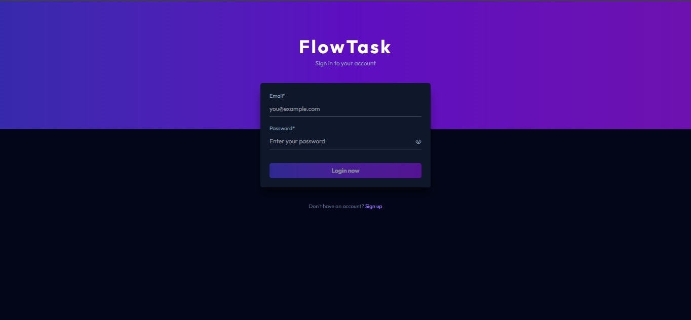
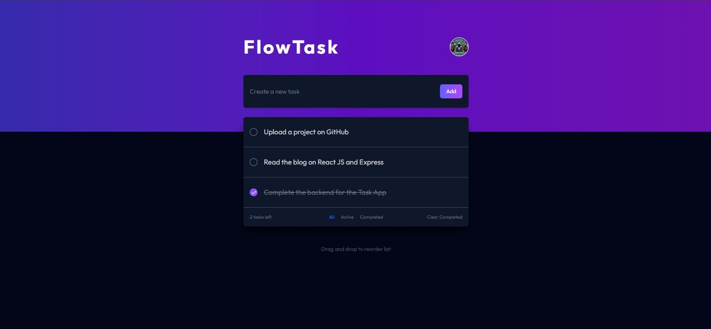
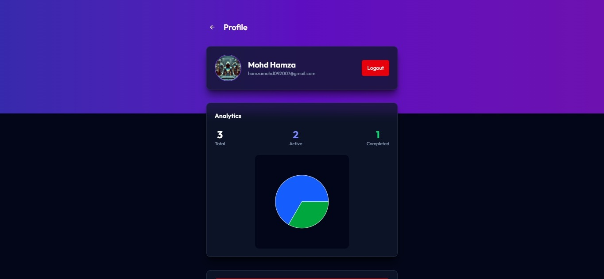
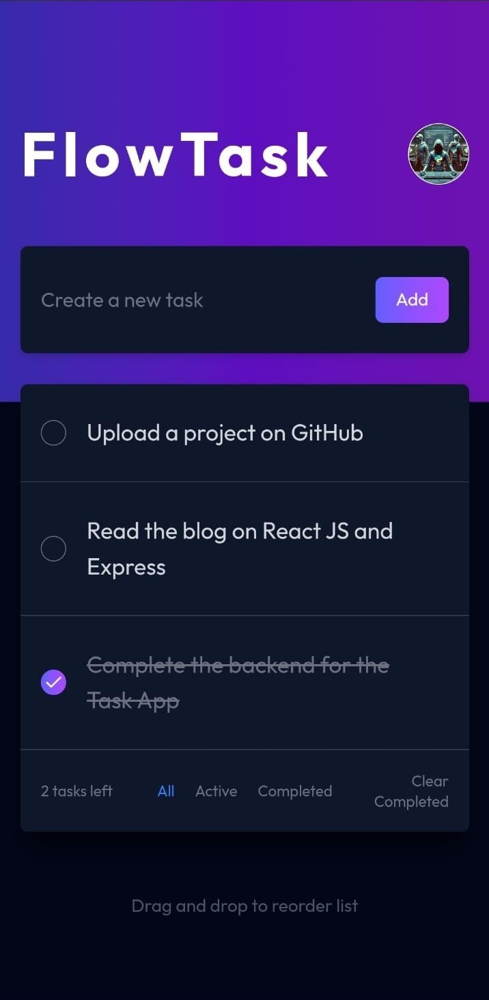

# 🚀 FlowTask

FlowTask is a full-stack MERN Todo application that helps users manage tasks efficiently with advanced features like authentication, drag-and-drop organization, filtering, and analytics visualization.

---

## 📌 Overview

FlowTask allows users to:
- Create, update, and delete tasks (CRUD)
- Organize tasks using drag & drop
- Filter tasks based on status
- Track productivity with analytics (pie chart)
- Securely manage their account with authentication

This project focuses on improving task management experience with a clean UI and insightful data visualization.

---

## 🛠️ Tech Stack

**Frontend:**
- React.js  

**Backend:**
- Node.js  
- Express.js  

**Database:**
- MongoDB  

**Authentication:**
- JSON Web Token (JWT)  
- bcrypt  

**Other Tools & Services:**
- Cloudinary (for user avatars)  
- Vercel (Frontend Deployment)  
- Render (Backend Deployment)  

---

## ✨ Features

- 🔐 User Authentication (Signup/Login)
- ✅ Full CRUD Operations for Tasks
- 📊 Analytics Dashboard (Pie Chart for task progress)
- 🎯 Task Filtering (based on status)
- 🔄 Drag & Drop Task Management
- 🖼️ User Avatar Upload (Cloudinary)

---

## 📸 Screenshots

### Desktop







### Mobile



---

## 🌐 Live Demo

- Frontend: [FlowTask - Vercel](https://flow-task-phi.vercel.app)
- Backend: [FlowTask - Render](https://flowtask-6qzn.onrender.com)

---

## ⚙️ Installation & Setup

```bash
# Clone the repository
git clone https://github.com/hamzamohd092007/flowtask.git

# Navigate to project folder
cd FlowTask

# Install frontend dependencies
cd client
npm install

# Install backend dependencies
cd server
npm install

# Run frontend
npm run dev

# Run backend
npm run server
```

---

## 🔐 Environment Variables

Create a `.env` file in the root and add:

```
PORT=
CLIENT_URL=
MONGODB_URL=
JWT_SECRET=
CLOUD_NAME=
CLOUD_API_KEY=
CLOUD_API_SECRET=
```

---

## 🧠 Learnings

- Implemented secure authentication using JWT & bcrypt  
- Built full-stack MERN application  
- Implemented drag-and-drop functionality  
- Created analytics dashboard using charts  

---

## 🚧 Future Improvements

- 📱 Improve mobile responsiveness  
- 🔔 Add notifications & reminders  
- 🧩 Enhance analytics  
- 👥 Add collaboration features  

---

## 👨‍💻 Author

**Mohd Hamza**  
GitHub: https://github.com/hamzamohd092007  

---

## ⭐ Show Your Support

If you like this project, give it a ⭐ on GitHub!
